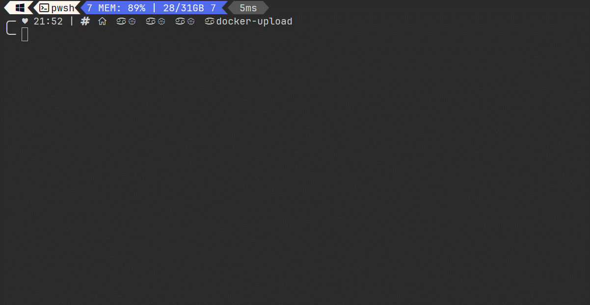

# Docker Upload

## 适合中国程序员的docker镜像中转工具，支持一键将本地镜像上传到云服务器

## 📖简介
总所周知，由于一些无可奉告的原因，在云服务器`docker pull`拉取镜像都会显示`connect: connection timed out`超时报错。
当前的几种解决方法：
1. 云服务器搭建科学上网（生产环境你搭个试试）
2. 使用一些没经过审查的镜像源（可能随时用不了，还有可能装到不安全的镜像）
3. 自己搭建镜像源（麻烦）
4. 用有科学上网的本地电脑拉取镜像后再上传到云服务器

`DockerUpload` 使用的是第4种方法，只需要一行命令，帮你自动执行命令，完成多个镜像打包、传输和加载。


## 🔨使用指南

### 配置SSH

在`~/.ssh/config`中添加云服务器的配置信息，例如：
```shell
Host myserver
    HostName your.server.ip
    User yourusername
    Port 22
    IdentityFile ~/.ssh/id_rsa
```

### 运行docker-upload
```shell
npx docker-upload
```

1. 根据提示选择要传输的镜像（支持多选）  
2. 根据提示选择云服务器（支持搜索）  
3. 输入ssh密码  


## 🔣原理

`docker-upload` 只是帮你自动执行了下面命令而已，没有什么技术含量：
```shell
# 1. 打包docker image
docker save xxx
# 2. 传输到云服务器
scp xxx.tar user@server:/tmp/xxx.tar
# 3. 在云服务器加载docker image
ssh user@server 'docker load -i /tmp/xxx.tar'
```
